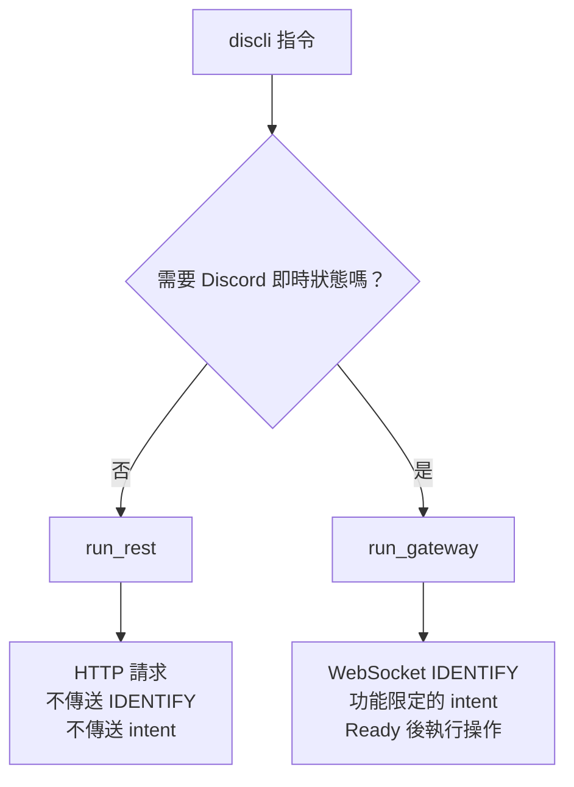

# 連線模型

discli 透過兩種不同的傳輸方式與 Discord 通訊。指令採用哪一種方式，會決定你必須在 Developer Portal 啟用哪些設定。

- **HTTP（REST）**：透過 `discord.com/api` 進行請求與回應。使用 bot token 驗證，沒有持續連線的 socket，且**不會傳送 intent**。
- **Gateway**：持續連線的 WebSocket。開啟連線時會傳送 `IDENTIFY` payload，宣告 bot 要求的 intent 並消耗 session-start 配額；如果 Developer Portal 未啟用所宣告的特權 intent，連線會直接遭到拒絕。

所有一次性 discli 指令都使用 HTTP。只有需要 Discord 即時狀態的功能才會開啟 Gateway 會話。

<Callout type="note">
在 v0.10.0 以前，*每個*指令都會使用 `Intents.all()` 開啟 Gateway 會話。因此，只要關閉一項不相關的特權 intent，`discli message send` 就會失敗，而且單次 HTTP 呼叫也會消耗 session-start 配額。詳見[從舊模型遷移](#從舊模型遷移)。
</Callout>

## 指令會使用哪一條路徑？



| 路徑 | 指令 | 傳輸方式 |
|---|---|---|
| **REST** | `message`、`reaction`、`channel`、`role`、`member`、`thread`、`poll`、`webhook`、`event`、`dm`、`typing`、`server`、`interact` | 僅使用 HTTP |
| **Gateway（一次性）** | `voice` 子命令 | WebSocket，操作完成後關閉 |
| **Gateway（持續連線）** | `listen`、`serve` | WebSocket，維持連線 |

`interact` 走 REST 路徑，因為它透過 HTTP 發布元件；元件的*回應*會傳入執行中的 `discli serve`，而非傳回發布元件的指令。

## 各功能所需的 intent

Gateway 指令會透過 `client.py` 的 `build_gateway_intents()`，建立足以支援指定功能的最小 intent 集合。discli 絕不會傳送 `Intents.all()`。

| 功能 | 啟用的 intent | 是否為特權 intent？ |
|---|---|---|
| *一律啟用* | `guilds` | 否 |
| `messages` | `guild_messages`、`dm_messages`、`message_content` | **Message Content** |
| `reactions` | `guild_messages`、`dm_messages`、`guild_reactions`、`dm_reactions` | 否 |
| `members` | `members` | **Server Members** |
| `voice` | `voice_states` | 否 |

`reactions` 功能會啟用訊息 intent，但不會啟用 `message_content`：discord.py 需要 message-create 事件填入 reaction 事件所讀取的快取，但不需要訊息本文。

`discli listen --events ...` 與 `discli serve --events ...` 會將事件篩選條件對應至這些功能，因此越窄的 `--events` 篩選條件，會產生越窄的 `IDENTIFY`：

```bash
# 只要求 guilds 與 reactions；Message Content 保持關閉。
discli listen --events reactions

# 要求 guilds、messages 與 message_content；需要 Message Content intent。
discli listen --events messages
```

`discli serve` 一律會在事件篩選條件之外加上 `voice` 功能，因為它會透過 stdin 動態接受語音操作，無法預先得知是否會收到這類操作。

## 仍需特權 intent 的情況

不使用 Gateway 會話，不代表指令可以免除 Discord 伺服器端規則。無論採用哪種傳輸方式，部分 HTTP 端點與回應欄位仍會依應用程式的 intent 設定限制存取：

- **列出伺服器的所有成員**，例如 `discli member list` 與 `discli role list --with-member-counts`，需要 **Server Members**。若未啟用，Discord 會回傳 `403`；discli 會將成員數顯示為 `unavailable`，而不是誤導性的 `0`。
- **讀取任意訊息內容**可能需要 **Message Content**。

缺少 intent 時，兩條路徑的差異在於失敗方式。Gateway 路徑會由 Discord 以 `PrivilegedIntentsRequired` 拒絕整個連線；REST 路徑則只有特定呼叫回傳 `403`，其他功能仍可繼續運作。

<Callout type="tip">
以名稱查找成員與使用者時，會先查詢快取，再改用 HTTP。一次性指令的快取是空的，因此 `discli member info "server" "alice"` 會使用 REST 備援路徑，並需要 Server Members。若改傳數字 ID，便可完全略過搜尋，而且不需要任何特權 intent。
</Callout>

## 實務影響

- **確實落實最小權限。** 只有需要接收即時訊息事件時才啟用 Message Content；只有需要列出成員或依名稱搜尋成員時才啟用 Server Members。僅使用 REST 的工作流程可在兩者皆關閉的情況下運作。
- **不消耗 session-start 配額。** Discord 會限制每日 `IDENTIFY` 呼叫次數。每分鐘執行一次 `discli message send` 的排程工作，不再計入此配額。
- **受速率限制，而非交握限制。** 一次性指令受 Discord HTTP 速率限制約束，而不需要 WebSocket 交握，因此回應較快，失敗方式也不同；高負載時應預期收到 `429`，而不是連線錯誤。
- **每個 token 仍只能執行一個 `serve`。** 未使用分片時，Discord 每個 bot token 只允許一條 Gateway 連線。此限制適用於仍會開啟 socket 的 `listen`、`serve` 與 `voice`。REST 指令可與執行中的 `discli serve` 同時運作。

## 從舊模型遷移

CLI 介面沒有變更，但有兩項行為不同：

1. **過去因缺少 intent 而失敗的指令現在可以成功執行。** 若你純粹為了讓一次性指令運作而啟用特權 intent，現在可以將它們關閉。
2. **`discli role list` 預設不再計算成員數。** 計算時必須逐一取得完整成員清單，速度慢、容易觸發速率限制，且需要特權。若要恢復舊輸出，請傳入 `--with-member-counts`（CLI）或 `"with_member_counts": true`（serve 操作）。未指定時，`members` 會顯示為 `unavailable` / `null`。

`client.py` 仍匯出 `run_discord()`，作為 `run_rest()` 的別名，以支援直接匯入它的程式。
