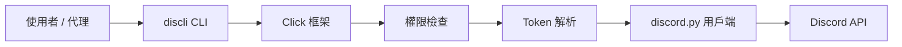
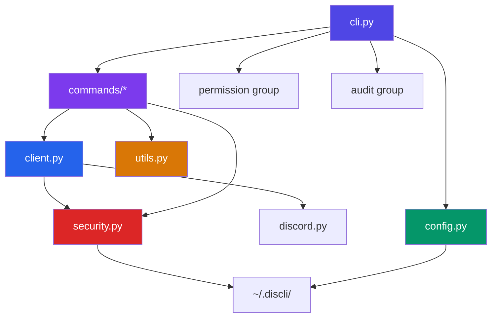
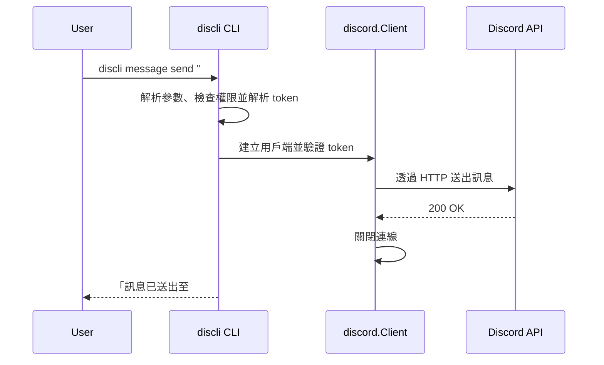
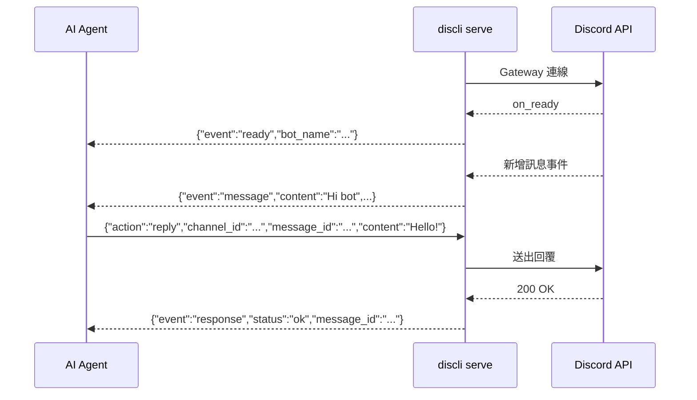

# 架構總覽

discli 是一個以 [Click](https://click.palletsprojects.com/) 與 [discord.py](https://discordpy.readthedocs.io/) 建置的 Python CLI。它有兩種模式：

- **一次性指令**（發起後不需維持連線的 CLI 指令），用於單次操作；
- **持續式 serve 模式**，用於與 AI 代理即時雙向溝通。

## 高階請求流程

每次呼叫 discli 都會依照以下流程，從使用者輸入到 Discord API 呼叫：



1. 使用者（或 AI 代理）呼叫一個 `discli` 指令。
2. Click 解析參數與全域選項（`--token`、`--json`、`--yes`、`--profile`）。
3. 檢查目前啟用的權限設定檔，確認指令是否被允許。
4. 從旗標、環境變數或設定檔解析機器人權杖（token）。
5. 單次指令會驗證 HTTP 用戶端並直接執行；即時指令會建立 Gateway 用戶端並套用各功能所需的 intent，詳見[連線模型](/architecture/connection-model)。
6. Discord API 處理請求。

## 模組依賴關係圖



## 模組角色

| 模組 | 檔案 | 用途 |
|---|---|---|
| **CLI 進入點** | `cli.py` | Click 根命令群組。註冊所有指令群組，定義全域選項，並掛載 `permission` 與 `audit` 子命令。 |
| **命令群組** | `commands/*.py` | 每個檔案定義一個 Click 命令群組。一次性動作使用 `run_rest()`；即時狀態與語音動作走 Gateway 路徑。 |
| **Client** | `client.py` | 解析 token、分離 REST 與 Gateway 生命週期、執行權限檢查，並建立 Gateway 功能所需的最小 intents。 |
| **安全模組** | `security.py` | 權限設定檔（允許/拒絕清單）、`is_command_allowed()` 檢查、`audit_log()` JSONL 紀錄、`RateLimiter`（權杖桶速率限制）、`check_user_permission()` Discord 層權限檢查，以及高風險操作確認。 |
| **Config** | `config.py` | 讀取與寫入 `~/.discli/config.json`。處理權杖持久化與設定整併。 |
| **Utils** | `utils.py` | `output()` 支援 `--json`；非同步資源解析器會優先查詢快取，找不到時再透過 REST，以名稱或 ID 解析資源。 |
| **Serve** | `commands/serve.py` | 持續式機器人模式。由 stdin 讀取 JSONL，將 JSONL 輸出到 stdout。約 2,200 行，涵蓋 65+ 個動作、事件轉發、斜線指令註冊，以及每 1.5 秒批次輸出串流訊息。 |

## 兩種運作模式

### 模式一：一次性 CLI 指令

這是預設模式。每個指令建立一個短生命週期的 HTTP 驗證 `discord.Client`，執行單一操作後即退出，不會開啟 Gateway 會話。



這種方式簡潔且無狀態。它會受 Discord HTTP 速率限制影響，但不會送出 Gateway `IDENTIFY`、不會消耗 session-start 配額，且不需要不相關的 Gateway intents。

**最適用於：** 腳本、自動排程任務、單次操作、串接其他工具。

`voice` 指令是此模式的例外：它們需要即時語音狀態，因此會開啟僅限 `voice` 功能的 Gateway 會話，並在操作完成後關閉。REST/Gateway 的完整分工及各功能要求的 intent，請參閱[連線模型](/architecture/connection-model)。

### 模式二：持續式 serve 模式

`discli serve` 會啟動長生命週期機器人，透過 stdin/stdout 使用逐行 JSON（JSONL）溝通。機器人會維持與 Discord Gateway 連線並即時轉發事件。



Serve 模式會維持持續狀態：
- **Typing 指示器**：逐頻道啟停（透過動作）
- **串流編輯**：每 1.5 秒批次推送內容更新，以配合 Discord 的速率限制
- **Slash 指令註冊**：啟動時逐伺服器同步
- **互動 token**：用於延遲 slash 指令回應

**最適用於：** AI 代理、聊天機器人、即時監控、互動式應用。

<Callout type="info">
  Serve 模式改用執行緒型 stdin 讀取器，而非 `asyncio.connect_read_pipe`，因為當 stdin 由父行程透過 pipe 提供時，後者在 Windows 會失敗。讀取器執行緒將每行資料放進 `queue.Queue`，而 asyncio 事件迴圈透過 `run_in_executor` 取回。
</Callout>

## 命令註冊

所有命令群組皆在 `cli.py` 中透過 `main.add_command()` 註冊：

```python
main.add_command(channel_group)
main.add_command(config_group)
main.add_command(dm_group)
main.add_command(listen_cmd)
main.add_command(member_group)
main.add_command(message_group)
main.add_command(reaction_group)
main.add_command(role_group)
main.add_command(server_group)
main.add_command(poll_group)
main.add_command(thread_group)
main.add_command(typing_cmd)
main.add_command(serve_cmd)
main.add_command(permission_group)
main.add_command(audit_group)
```

每個命令群組都對應 `commands/` 中的一個檔案。新增命令群組採同樣流程：先在新檔案定義 Click 命令，再在 `cli.py` 註冊該群組。

## 主要設計決策

| 決策 | 理由 |
|---|---|
| **Click 優於 argparse** | Click 提供巢狀命令群組、內建說明產生與 context 傳遞，與 discli 的 `discli <group> <command>` 架構天然匹配。 |
| **每個 CLI 指令建立暫時 client** | 命令可維持無狀態，且降低連線管理複雜度。1 到 2 秒的啟停成本可接受於腳本使用情境。 |
| **serve 通訊使用 JSONL** | 逐行 JSON 在任何語言都容易解析、可串流、格式明確。任意代理框架都能讀寫。 |
| **權限設定檔放在 CLI 層** | 可在發出任何 Discord API 呼叫前即阻擋誤用。即使機器人在 Discord 層有權限，`readonly` 設定檔也無法傳送訊息。 |
| **安全模組獨立** | 權限檢查、稽核紀錄與速率限制集中在同一模組，讓所有指令路徑都走同一套規則。 |

## 後續步驟

<CardGroup cols={2}>
  <Card title="Serve 協定" href="/architecture/serve-protocol">
    說明 serve 模式 stdin/stdout JSONL 通訊協定的完整規格。
  </Card>
  <Card title="安全模型" href="/architecture/security-model">
    權限設定檔、稽核紀錄、速率限制與高風險操作保護。
  </Card>
  <Card title="Token 解析" href="/architecture/token-resolution">
    discli 如何跨旗標、環境變數與設定檔找到機器人 token。
  </Card>
  <Card title="CLI 使用指南" href="/guides/cli-usage">
    每日使用 discli 指令的實務操作指引。
  </Card>
</CardGroup>
