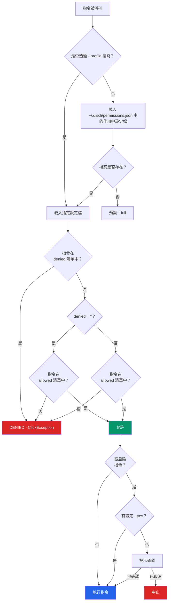
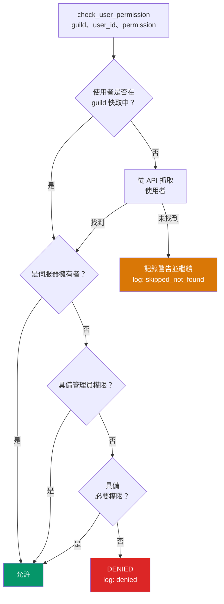

# 安全模型

discli 在任何 Discord API 呼叫之前，先於 CLI 層執行分層式安全控管。這代表即使機器人 token 在 Discord 中有完整權限，使用 `readonly` 設定檔的 AI 代理也無法傳送訊息。

## 權限強制流程



## 權限設定檔

discli 內建四種設定檔。每個設定檔都有 `allowed` 與 `denied` 清單。萬用字元 `*` 代表全部指令。

<Tabs>
  <Tab title="full">
    ```json
    {
      "description": "完全存取所有指令",
      "allowed": ["*"],
      "denied": []
    }
    ```
    預設設定檔。所有指令都允許執行。
  </Tab>
  <Tab title="chat">
    ```json
    {
      "description": "僅允許訊息、反應、討論串、正在輸入",
      "allowed": [
        "message", "reaction", "thread", "typing",
        "dm", "listen", "serve", "config", "server"
      ],
      "denied": [
        "member kick", "member ban", "member unban",
        "channel delete", "role delete", "role create",
        "channel create"
      ]
    }
    ```
    允許對話類指令。封鎖審核與結構變更相關操作。
  </Tab>
  <Tab title="readonly">
    ```json
    {
      "description": "唯讀：list、info、get、search、listen",
      "allowed": [
        "message list", "message get", "message search",
        "message history", "channel list", "channel info",
        "server list", "server info", "role list",
        "member list", "member info", "reaction list",
        "thread list", "listen", "config show"
      ],
      "denied": ["*"]
    }
    ```
    僅允許讀取操作。`denied: ["*"]` 會擋掉未明確列在 `allowed` 的其他指令。
  </Tab>
  <Tab title="moderation">
    ```json
    {
      "description": "完全存取，包含審核相關功能",
      "allowed": ["*"],
      "denied": []
    }
    ```
    目前與 `full` 完全一致。保留此名稱主要為語意清楚並方便未來延伸。
  </Tab>
</Tabs>

### `is_command_allowed()` 的運作方式

權限檢查採用「先拒絕後允許」策略：

1. **先解析設定檔。** 若有傳入 `--profile`，使用對應內建設定檔；否則從 `~/.discli/permissions.json` 讀取，若檔案不存在則預設為 `full`。
2. **先檢查 `denied` 清單。** 若 `denied` 包含 `*`，一律拒絕，除非該指令同時落在 `allowed` 白名單。若有明確符合的拒絕模式，也會直接封鎖。
3. **再檢查 `allowed` 清單。** 若 `allowed` 包含 `*`，指令直接通過；否則需符合允許清單中的模式。
4. **模式比對採前綴匹配。** `"message"` 可比對到 `message send`、`message list`、`message delete` 等。精準比對 `"message send"` 則只允許該子指令。

```python
# 這些模式會符合 "message send"：
"*"              # wildcard
"message"        # 前綴比對
"message send"   # 精準比對

# 這些不會符合 "message send"：
"message list"   # 不同子指令
"msg"            # 不是指令路徑的前綴
```

### 設定啟用中的設定檔

```bash
# 將設定檔套用到後續所有指令
discli permission set readonly

# 單次指令覆蓋設定
discli --profile chat message send "#general" "Hello"

# 顯示目前設定檔
discli permission show

# 列出所有設定檔
discli permission profiles
```

### 自訂設定檔

編輯 `~/.discli/permissions.json` 來建立自訂設定檔：

```json
{
  "active_profile": "support-agent",
  "profiles": {
    "support-agent": {
      "description": "可閱讀與回覆，但不能刪除或管理",
      "allowed": [
        "message list", "message get", "message search",
        "message send", "reply",
        "channel list", "channel info",
        "server list", "server info",
        "thread list", "thread create", "thread send",
        "typing", "reaction", "listen", "serve"
      ],
      "denied": [
        "message delete",
        "member kick", "member ban",
        "channel delete", "channel create",
        "role delete", "role assign", "role remove"
      ]
    }
  }
}
```

當自訂設定檔名稱與內建設定檔重名時，會以自訂設定檔為準。`active_profile` 決定預設載入哪一組規則。

## 高風險操作確認

部分指令被標記為高風險，執行前會要求明確確認：

| 指令 | 行為 |
|---|---|
| `member kick` | 從伺服器移除成員 |
| `member ban` | 封鎖（ban）成員 |
| `member unban` | 解除先前封鎖成員 |
| `channel delete` | 永久刪除頻道 |
| `message delete` | 刪除訊息 |
| `role delete` | 刪除身分組 |

當高風險指令執行時，discli 會提示：

```
⚠ 破壞性操作：移除成員（member kick）（使用者：Alice#1234）。是否繼續？[y/N]
```

若要略過提示（用於自動化場景），可傳 `--yes` 或 `-y`：

```bash
discli --yes message delete "#general" 123456789
```

<Callout type="warning">
  `--yes` 會繞過所有確認提示。請僅在已採取其他防線的自動化流程中使用，並搭配限制較窄的權限設定檔，避免過度自動授權。
</Callout>

## 稽核紀錄

每次指令執行都會寫入 JSONL 稽核日誌：`~/.discli/audit.log`。每一行都是一個 JSON 物件：

```json
{
  "timestamp": "2026-03-15T10:30:00.123456+00:00",
  "command": "message send",
  "args": {"channel": "#general", "content": "Hello"},
  "result": "ok",
  "user": ""
}
```

| 欄位 | 說明 |
|---|---|
| `timestamp` | ISO 8601 UTC 時間戳 |
| `command` | 執行的指令路徑 |
| `args` | 指令接收的參數（不會寫入 token） |
| `result` | 成功為 `"ok"`，或錯誤描述 |
| `user` | 觸發動作的 Discord 使用者（由 `--triggered-by` 或 slash command 填入） |

### 查看與管理稽核紀錄

```bash
# 顯示最後 20 筆
discli audit show

# 顯示最後 50 筆
discli audit show --limit 50

# 以 JSON 輸出
discli --json audit show

# 清除紀錄
discli audit clear
```

<Callout type="note">
  稽核紀錄同時也會記錄權限檢查事件。當 `check_user_permission()` 拒絕使用者或找不到成員時，會寫入 `permission_check`，結果為 `denied` 或 `skipped_not_found`。
</Callout>

## 速率限制

discli 提供用戶端速率限制，避免超過 Discord API 的頻率限制。使用 **Token bucket**（令牌桶）演算法：

- **桶容量：** 5 次呼叫
- **補充週期：** 5 秒
- **行為：** 當桶空時，discli 會自動等待直到有可用令牌，並在 `stderr` 輸出提示

```
速率限制中。等待 3.2 秒中……
```

速率限制器是全域單例（`security.rate_limiter`）。它會追蹤呼叫時間戳，並在每次呼叫時清理過期項目：

```python
class RateLimiter:
    def __init__(self, max_calls: int = 5, period: float = 5.0):
        self.max_calls = max_calls
        self.period = period
        self.calls: list[float] = []

    def wait(self) -> None:
        now = time.time()
        self.calls = [t for t in self.calls if now - t < self.period]
        if len(self.calls) >= self.max_calls:
            sleep_time = self.period - (now - self.calls[0])
            if sleep_time > 0:
                time.sleep(sleep_time)
        self.calls.append(time.time())
```

這是在 discord.py 內建速率限制之外的保險措施。它能防止短時間內高頻率多次 CLI 呼叫，導致 Discord 全域速率限制被觸發。

## Discord 層級權限檢查

對於 Discord 使用者觸發的操作（例如透過 `--triggered-by` 的 slash command），discli 會驗證該使用者在伺服器中是否具備必要權限。

`check_user_permission()` 會先解析使用者，再檢查其在伺服器層級的權限：



支援的權限檢查：

| 權限鍵值 | Discord 權限 |
|---|---|
| `kick` | `kick_members` |
| `ban` | `ban_members` |
| `manage_channels` | `manage_channels` |
| `manage_roles` | `manage_roles` |
| `manage_messages` | `manage_messages` |

<Callout type="info">
  當找不到使用者（快取未命中且 API 重新抓取失敗）時，discli 會記錄警告並 **繼續執行**，而不會直接阻擋指令。這可處理快取不完整的邊界情境。
</Callout>

## 安全建議

1. **AI 代理請使用 `readonly` 或 `chat` 設定檔**，可降低意外高風險操作機率。
2. **定期使用 `discli audit show` 檢視稽核紀錄**，追蹤代理的實際行為。
3. **切勿提交權杖** 到版本控制。CI 建議使用環境變數，本機開發可放在 `~/.discli/config.json`。
4. **慎用 `--yes`**，僅在權限設定檔已經嚴格限制的流程中使用。
5. **依代理需求建立自訂設定檔**，不要長期依賴權限過寬的預設設定檔。

## 後續步驟

<CardGroup cols={2}>
  <Card title="Token 解析" href="/architecture/token-resolution">
    說明 discli 如何尋找並保護機器人 token。
  </Card>
  <Card title="架構總覽" href="/architecture/overview">
    瞭解安全模組在整體架構中的位置。
  </Card>
</CardGroup>
