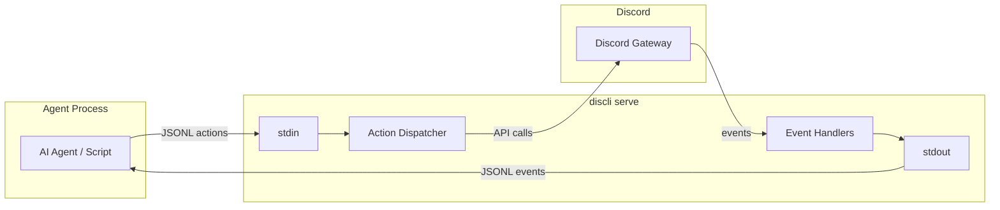

# Serve 協定

`discli serve` 透過 stdin 與 stdout 實作雙向通訊協定，資料格式為 **逐行 JSON（JSONL）**。每一行都是獨立 JSON 物件。事件從 stdout 輸出；動作從 stdin 輸入。



## 協定基礎

- **傳輸：** stdin（動作）與 stdout（事件），每行一個 JSON 物件
- **編碼：** UTF-8
- **分隔：** 換行字元（`\n`），每行為完整 JSON 物件
- **方向：** stdout 為伺服器到用戶端（事件），stdin 為用戶端到伺服器（動作）
- **關聯識別：** 動作可包含 `req_id`；對應回應會回寫同一值

<Callout type="warning">
  serve 模式程式化使用時，請不要輸出非 JSONL 內容到 stdout。診斷訊息都應寫入 stderr。若需除錯，請改讀取 stderr。
</Callout>

## 事件（stdout）

事件由 discli 在 Discord 發生對應狀態時發出。每個事件物件都會有 `"event"` 欄位標示類型。

### 生命週期事件

| 事件 | 欄位 | 說明 |
|---|---|---|
| `ready` | `bot_id`, `bot_name` | 機器人已連上 Discord Gateway |
| `slash_commands_synced` | `count`, `guilds` | Slash 指令已向 Discord 註冊 |
| `error` | `message` | 內部錯誤（非致命） |
| `shutdown` | -- | 機器人正在關閉 |

### 訊息事件

| 事件 | 欄位 | 說明 |
|---|---|---|
| `message` | `message_id`, `channel_id`, `channel`, `server`, `server_id`, `author`, `author_id`, `content`, `is_bot`, `mentions_bot`, `is_dm`, `timestamp`, `attachments`, `reply_to` | 收到新訊息 |
| `message_edit` | `message_id`, `channel_id`, `channel`, `server`, `server_id`, `author`, `author_id`, `old_content`, `new_content`, `timestamp` | 訊息被編輯 |
| `message_delete` | `message_id`, `channel_id`, `channel`, `server`, `server_id`, `author`, `author_id`, `content` | 訊息被刪除 |

### 互動事件

| 事件 | 欄位 | 說明 |
|---|---|---|
| `slash_command` | `command`, `args`, `user`, `user_id`, `channel_id`, `guild_id`, `interaction_token`, `is_admin` | 使用者觸發 slash command |
| `component_interaction` | `custom_id`, `component_type`, `values`, `user`, `user_id`, `channel_id`, `message_id`, `interaction_token` | 點擊按鈕或選擇下拉選單 |
| `modal_submit` | `custom_id`, `fields`, `user`, `user_id`, `channel_id`, `interaction_token` | 使用者提交 modal 表單 |

### 語音事件

| 事件 | 欄位 | 說明 |
|---|---|---|
| `voice_state` | `user`, `user_id`, `channel`, `channel_id`, `old_channel`, `old_channel_id`, `guild_id`, `self_mute`, `self_deaf` | 使用者加入、離開或移動語音頻道 |

### 連線事件

| 事件 | 欄位 | 說明 |
|---|---|---|
| `disconnected` | `code`, `reason` | 機器人從 Discord Gateway 斷線 |
| `resumed` | -- | 會話已重連並恢復 |

### 表情事件

| 事件 | 欄位 | 說明 |
|---|---|---|
| `reaction_add` | `emoji`, `user`, `user_id`, `message_id`, `channel_id`, `server`, `channel` | 新增訊息表情 |
| `reaction_remove` | `emoji`, `user`, `user_id`, `message_id`, `channel_id`, `server`, `channel` | 移除訊息表情 |

### 成員事件

| 事件 | 欄位 | 說明 |
|---|---|---|
| `member_join` | `member`, `member_id`, `server`, `server_id` | 成員加入伺服器 |
| `member_remove` | `member`, `member_id`, `server`, `server_id` | 成員離開或被移除 |

### 回應事件

每個透過 stdin 發出的動作都會在 stdout 產生回應：

| 事件 | 欄位 | 說明 |
|---|---|---|
| `response` | `status`（`ok` 或 `error`）、`req_id`（若有）與 action 專用欄位 | 指定動作的執行結果 |

#### 事件範例

<Tabs>
  <Tab title="message">
    ```json
    {
      "event": "message",
      "server": "My Server",
      "server_id": "111111111111111111",
      "channel": "general",
      "channel_id": "222222222222222222",
      "author": "Alice#1234",
      "author_id": "333333333333333333",
      "is_bot": false,
      "content": "Hello bot!",
      "timestamp": "2026-03-15T10:30:00+00:00",
      "message_id": "444444444444444444",
      "mentions_bot": true,
      "is_dm": false,
      "attachments": [],
      "reply_to": null
    }
    ```
  </Tab>
  <Tab title="slash_command">
    ```json
    {
      "event": "slash_command",
      "command": "ask",
      "args": {"question": "什麼是 discli？"},
      "channel_id": "222222222222222222",
      "user": "Alice#1234",
      "user_id": "333333333333333333",
      "guild_id": "111111111111111111",
      "interaction_token": "a1b2c3d4-e5f6-7890-abcd-ef1234567890",
      "is_admin": false
    }
    ```
  </Tab>
  <Tab title="response">
    ```json
    {
      "event": "response",
      "req_id": "msg-001",
      "ok": true,
      "message_id": "555555555555555555"
    }
    ```
  </Tab>
</Tabs>

## 動作（stdin）

動作是 JSON 物件，透過 stdin 送入 discli。每個動作都必須有 `"action"` 欄位。可選擇加入 `"req_id"` 以對應回應。

```json
{"action": "send", "channel_id": "222222222222222222", "content": "Hello!", "req_id": "msg-001"}
```

### 訊息操作

| 動作 | 必要欄位 | 選用欄位 | 說明 |
|---|---|---|---|
| `send` | `channel_id`, `content` | `embed`, `components`, `files`, `req_id` | 傳送訊息到頻道 |
| `reply` | `channel_id`, `message_id`, `content` | `embed`, `components`, `files`, `req_id` | 回覆指定訊息 |
| `edit` | `channel_id`, `message_id`, `content` | `embed`, `components`, `req_id` | 編輯機器人訊息 |
| `delete` | `channel_id`, `message_id` | `req_id` | 刪除訊息 |

### 串流回應

串流可逐步更新同一則訊息，類似 ChatGPT 的回應方式。內容先暫存，並每 1.5 秒一次批次送到 Discord，以符合速率限制。

| 動作 | 必要欄位 | 選用欄位 | 說明 |
|---|---|---|---|
| `stream_start` | `channel_id` | `reply_to`, `interaction_token`, `req_id` | 開始串流訊息（先送 `...` 佔位內容） |
| `stream_chunk` | `stream_id`, `content` | `req_id` | 將文字加入串流暫存 |
| `stream_end` | `stream_id` | `req_id` | 結束串流並送出剩餘內容 |

<Callout type="tip">
  `stream_start` 會回傳 `stream_id`，後續 `stream_chunk` 與 `stream_end` 必須帶入同一值。若內容超過 Discord 2000 字上限，`stream_end` 會自動拆成多則訊息。
</Callout>

#### 串流範例

```json
{"action": "stream_start", "channel_id": "222222222222222222", "req_id": "s1"}
```
```json
{"event": "response", "req_id": "s1", "stream_id": "a1b2c3d4", "message_id": "555555555555555555"}
```
```json
{"action": "stream_chunk", "stream_id": "a1b2c3d4", "content": "以下是"}
```
```json
{"action": "stream_chunk", "stream_id": "a1b2c3d4", "content": "您的問題回覆..."}
```
```json
{"action": "stream_end", "stream_id": "a1b2c3d4", "req_id": "s1-end"}
```

### 互動操作

| 動作 | 必要欄位 | 選用欄位 | 說明 |
|---|---|---|---|
| `interaction_respond` | `interaction_token`, `content` | `embed`, `components`, `ephemeral`, `req_id` | 對元件互動作立即回應 |
| `interaction_edit` | `interaction_token` | `content`, `embed`, `components`, `req_id` | 編輯原始互動訊息 |
| `interaction_followup` | `interaction_token`, `content` | `embed`, `components`, `req_id` | 對 slash command 送出追蹤回應 |
| `modal_send` | `interaction_token`, `title`, `custom_id`, `fields` | `req_id` | 在互動事件中開啟 modal 表單 |

<Callout type="note">
  Slash command 互動會自動使用「思考中」狀態延遲回應。依照 Discord 限制，必須在 15 分鐘內以 `interaction_followup` 或 `stream_start`（需 `interaction_token`）回應。
</Callout>

### 輸入指示

| 動作 | 必要欄位 | 選用欄位 | 說明 |
|---|---|---|---|
| `typing_start` | `channel_id` | `req_id` | 開始顯示「bot 正在輸入…」 |
| `typing_stop` | `channel_id` | `req_id` | 停止輸入指示 |

### 狀態更新

| 動作 | 必要欄位 | 選用欄位 | 說明 |
|---|---|---|---|
| `presence` | -- | `status`, `activity_type`, `activity_text`, `req_id` | 更新機器人狀態與活動 |

`status` 可為 `online`、`idle`、`dnd`、`invisible`。`activity_type` 可為 `playing`、`watching`、`listening`、`competing`。

### 表情操作

| 動作 | 必要欄位 | 選用欄位 | 說明 |
|---|---|---|---|
| `reaction_add` | `channel_id`, `message_id`, `emoji` | `req_id` | 對訊息加反應 |
| `reaction_remove` | `channel_id`, `message_id`, `emoji` | `req_id` | 移除機器人的反應 |

### 討論串

| 動作 | 必要欄位 | 選用欄位 | 說明 |
|---|---|---|---|
| `thread_create` | `channel_id`, `name` | `message_id`, `auto_archive_duration`, `content`, `req_id` | 建立討論串（可選擇性由訊息建立） |
| `thread_send` | `thread_id`, `content` | `files`, `req_id` | 在討論串發送訊息 |
| `thread_list` | `channel_id` | `req_id` | 列出頻道中的討論串 |
| `thread_archive` | `thread_id` | `req_id` | 封存討論串 |
| `thread_rename` | `thread_id`, `name` | `req_id` | 重新命名討論串 |
| `thread_add_member` | `thread_id`, `user_id` | `req_id` | 將成員加入討論串 |
| `thread_remove_member` | `thread_id`, `user_id` | `req_id` | 將成員移出討論串 |

### 投票

| 動作 | 必要欄位 | 選用欄位 | 說明 |
|---|---|---|---|
| `poll_send` | `channel_id`, `question`, `answers` | `duration_hours`, `multiple`, `content`, `req_id` | 在頻道建立投票 |
| `poll_results` | `channel_id`, `message_id` | `req_id` | 取得目前投票結果 |
| `poll_end` | `channel_id`, `message_id` | `req_id` | 提早結束投票 |

`answers` 是字串陣列，或含 `text` 且可選 `emoji` 欄位的物件陣列。最少需提供 2 個答案。

### 頻道

| 動作 | 必要欄位 | 選用欄位 | 說明 |
|---|---|---|---|
| `channel_list` | -- | `guild_id`, `req_id` | 列出頻道（可依伺服器過濾） |
| `channel_create` | `guild_id`, `name` | `type`, `req_id` | 建立頻道（`text`、`voice` 或 `category`） |
| `channel_info` | `channel_id` | `req_id` | 取得頻道明細 |
| `channel_edit` | `channel_id` | `name`, `topic`, `nsfw`, `slowmode`, `req_id` | 修改頻道設定 |
| `channel_set_permissions` | `channel_id`, `target_id`, `target_type` | `allow`, `deny`, `req_id` | 設定身分組或成員權限覆寫 |
| `forum_post` | `channel_id`, `name`, `content` | `tags`, `embed`, `req_id` | 在論壇頻道建立貼文 |

### 成員

| 動作 | 必要欄位 | 選用欄位 | 說明 |
|---|---|---|---|
| `member_list` | `guild_id` | `limit`, `req_id` | 列出伺服器成員（預設 50 筆） |
| `member_info` | `guild_id`, `member_id` | `req_id` | 取得含角色的成員詳細資料 |
| `member_timeout` | `guild_id`, `member_id`, `duration` | `reason`, `req_id` | 對成員啟用停權（最長 2419200 秒 / 28 天，填 0 可移除） |

### 身分組

| 動作 | 必要欄位 | 選用欄位 | 說明 |
|---|---|---|---|
| `role_list` | `guild_id` | `req_id` | 列出伺服器身分組 |
| `role_assign` | `guild_id`, `member_id`, `role_id` | `req_id` | 指派身分組 |
| `role_remove` | `guild_id`, `member_id`, `role_id` | `req_id` | 取消指派身分組 |
| `role_edit` | `guild_id`, `role_id` | `name`, `color`, `permissions`, `req_id` | 編輯身分組屬性 |

### 私訊

| 動作 | 必要欄位 | 選用欄位 | 說明 |
|---|---|---|---|
| `dm_send` | `user_id`, `content` | `req_id` | 傳送私人訊息 |

### 訊息查詢

| 動作 | 必要欄位 | 選用欄位 | 說明 |
|---|---|---|---|
| `message_list` | `channel_id` | `limit`, `req_id` | 列出最近訊息（預設 20 筆） |
| `message_get` | `channel_id`, `message_id` | `req_id` | 取得單筆訊息完整資料 |
| `message_search` | `channel_id` | `query`, `author`, `limit`, `req_id` | 依內容或作者搜尋訊息 |
| `message_pin` | `channel_id`, `message_id` | `req_id` | 釘選訊息 |
| `message_unpin` | `channel_id`, `message_id` | `req_id` | 取消釘選 |
| `message_bulk_delete` | `channel_id`, `message_ids` | `req_id` | 一次刪除多則訊息（2–100 則，最多 14 天前） |

### 表情（延伸）

| 動作 | 必要欄位 | 選用欄位 | 說明 |
|---|---|---|---|
| `reaction_users` | `channel_id`, `message_id`, `emoji` | `limit`, `req_id` | 列出對特定 emoji 按過反應的使用者 |

### Webhook

| 動作 | 必要欄位 | 選用欄位 | 說明 |
|---|---|---|---|
| `webhook_list` | `channel_id` | `req_id` | 列出頻道的 webhook |
| `webhook_create` | `channel_id`, `name` | `avatar`, `req_id` | 建立 webhook |
| `webhook_delete` | `webhook_id` | `req_id` | 刪除 webhook |

### 排程事件

| 動作 | 必要欄位 | 選用欄位 | 說明 |
|---|---|---|---|
| `event_list` | `guild_id` | `req_id` | 列出已排程事件 |
| `event_create` | `guild_id`, `name`, `start_time` | `end_time`, `description`, `channel_id`, `location`, `req_id` | 建立排程事件 |

### 伺服器

| 動作 | 必要欄位 | 選用欄位 | 說明 |
|---|---|---|---|
| `server_list` | -- | `req_id` | 列出機器人所在伺服器 |
| `server_info` | `guild_id` | `req_id` | 取得伺服器完整資訊 |

## 請求/回應關聯

每個動作可帶 `req_id`（任意字串）。回應會回填相同 ID，可在並行情境下對齊請求與回應。

```json
{"action": "send", "channel_id": "123", "content": "Hello", "req_id": "abc-001"}
```

```json
{"event": "response", "req_id": "abc-001", "ok": true, "message_id": "456"}
```

<Callout type="tip">
  如果你不帶 `req_id`，回應仍會被送出，但不含關聯識別。對單線程順序代理可接受；若同時發出多個動作，務必提供 `req_id`。
</Callout>

## 錯誤處理

動作失敗時，回應改以 `"error"` 取代 `"ok"`：

```json
{"event": "response", "req_id": "abc-002", "error": "Channel not found: 999"}
```

常見錯誤原因：

| 錯誤 | 成因 |
|---|---|
| `Missing 'action' field` | JSON 物件缺少 `action` 欄位 |
| `Unknown action: foo` | 行為名稱不在動作登錄表 |
| `Channel not found: ...` | 無效或不可存取的頻道 ID |
| `Missing 'guild_id'` | 必填欄位遺漏 |
| `Invalid JSON: ...` | stdin 其中一行不是有效 JSON |

非致命錯誤（例如 slash command 同步失敗）會以獨立 error 事件輸出：

```json
{"event": "error", "message": "Failed to sync commands to My Server: ..."}
```

## 事件篩選

可用指令參數篩選要轉送的事件：

```bash
# 僅轉送訊息與反應事件
discli serve --events messages,reactions

# 僅來自特定伺服器
discli serve --server "My Server"

# 僅來自特定頻道
discli serve --channel "#general"

# 不包含機器人自己的訊息
discli serve --no-include-self
```

可用事件過濾值：`messages`, `reactions`, `members`, `edits`, `deletes`, `voice`, `interactions`。

<Callout type="note">
  本協定目前支援 **54 個動作**與 **17 種事件類型**。完整清單請參考 [Serve 動作](/reference/serve-actions) 與 [Serve 事件](/reference/serve-events)。
</Callout>

## Slash 指令註冊

於啟動時可傳入 JSON 檔註冊 slash 指令：

```bash
discli serve --slash-commands commands.json
```

```json
[
  {
    "name": "ask",
    "description": "向機器人提問",
    "params": [
      {"name": "question", "type": "string", "required": true, "description": "你的問題"}
    ]
  },
  {
    "name": "status",
    "description": "檢查機器人狀態"
  }
]
```

指令會逐伺服器同步以提供即時可用性。使用者觸發 slash command 時，會收到 `slash_command` 事件，內含 `interaction_token`，供回應使用。

## 後續步驟

<CardGroup cols={2}>
  <Card title="架構總覽" href="/architecture/overview">
    了解 serve 模式在 discli 整體架構中的角色。
  </Card>
  <Card title="建立代理" href="/guides/building-agents">
    建置以 serve 協定通訊的 AI 代理。
  </Card>
</CardGroup>
