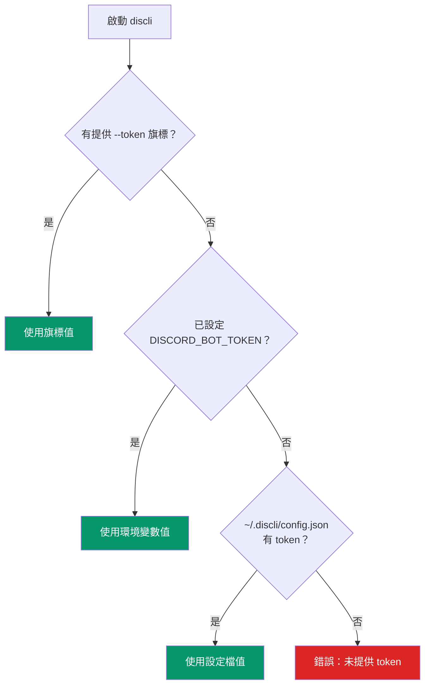

# Token 解析

discli 需要 Discord 機器人 token 才能進行 API 驗證。Token 會依照三層優先順序解析，提供不同環境下的彈性。

## 解析順序



### 優先順序

| 優先順序 | 來源 | 範例 |
|---|---|---|
| 1（最高） | `--token` CLI 旗標 | `discli --token Bot_ABC123 message send ...` |
| 2 | `DISCORD_BOT_TOKEN` 環境變數 | `export DISCORD_BOT_TOKEN=Bot_ABC123` |
| 3（最低） | `~/.discli/config.json` 檔案 | `{"token": "Bot_ABC123"}` |

第一個有非空值的來源會被採用。若三個來源皆未提供 token，discli 會直接結束並輸出錯誤：

```
錯誤：未提供 token。請使用 --token、設定 DISCORD_BOT_TOKEN，或執行：discli config set token YOUR_TOKEN
```

## 運作原理

Token 解析在 `cli.py` 與 `client.py` 中分兩階段完成：

**第一階段（CLI 進入）(`cli.py`)：** Click 的 `@click.option("--token", envvar="DISCORD_BOT_TOKEN")` 同時處理前兩層。若有傳入 `--token`，Click 使用該值；若未傳入，則改取 `DISCORD_BOT_TOKEN`。若都未設定，值為 `None`，discli 會改由設定檔載入。

```python
# cli.py — main group
@click.option("--token", envvar="DISCORD_BOT_TOKEN", default=None)
def main(ctx, token, ...):
    if token is None:
        config = load_config()
        token = config.get("token")
    ctx.obj["token"] = token
```

**第二階段（Client）(`client.py`)：** 在執行 Discord 行為前，`resolve_token()` 會確認 token 已存在。若 `ctx.obj["token"]` 仍為 `None`，就拋出錯誤。

```python
# client.py
def resolve_token(token: str | None, config: dict) -> str:
    if token:
        return token
    config_token = config.get("token")
    if config_token:
        return config_token
    raise click.ClickException("未提供 token。")
```

## 設定檔格式

設定檔位於 `~/.discli/config.json`：

```json
{
  "token": "Bot_YOUR_TOKEN_HERE"
}
```

透過 `config` 指令管理：

```bash
# 設定 token
discli config set token YOUR_BOT_TOKEN

# 查看目前設定
discli config show
```

檔案由 `discli config set` 自動建立；若 `~/.discli/` 目錄不存在也會一併建立。

<Callout type="warning">
  設定檔會將 token 以純文字儲存。請確認 `~/.discli/config.json` 權限設置得當。共用主機環境建議改用環境變數方案。
</Callout>

## 為何使用此順序

這個三層順序是為了對應不同使用情境設計：

<Tabs>
  <Tab title="本機開發">
    **設定檔** 適合日常使用，先寫入一次後可直接沿用：

    ```bash
    discli config set token YOUR_BOT_TOKEN
    # 接著所有指令都可直接使用，不需額外旗標
    discli message send "#general" "Hello"
    ```

    Token 會跨終端工作階段、重開機與 shell 切換持續保留。
  </Tab>
  <Tab title="CI / 自動化">
    **環境變數** 是 CI 流程與 Docker 的標準做法，可避免將機密寫到磁碟：

    ```yaml
    # GitHub Actions 範例
    env:
      DISCORD_BOT_TOKEN: ${{ secrets.DISCORD_BOT_TOKEN }}
    steps:
      - run: discli message send "#deploys" "Build ${{ github.sha }} deployed"
    ```

    ```bash
    # Docker 範例
    docker run -e DISCORD_BOT_TOKEN=... discli message send "#alerts" "Container started"
    ```
  </Tab>
  <Tab title="臨時測試">
    **CLI 旗標** 會覆寫其他來源，適合在測試不同 bot/token 時使用：

    ```bash
    # 使用 staging 機器人測試
    discli --token Bot_STAGING_TOKEN message send "#test" "Staging check"

    # 預設設定檔的 token 不受影響
    discli message send "#general" "Still uses config token"
    ```
  </Tab>
</Tabs>

## Token 保護

discli 對 token 採用以下保護措施：

| 措施 | 說明 |
|---|---|
| **不會紀錄** | token 不會寫入稽核紀錄。`args` 只保留指令參數，token 是分開解析且排除在外。 |
| **不輸出至終端結果** | `--json` 與文字輸出都不會包含 token。 |
| **錯誤訊息不回填 token** | 驗證失敗時只回報 `Invalid bot token`，不回顯 token 本身。 |
| **優先環境變數** | 第二優先等級使用環境變數，可避免 token 落地到檔案系統。 |

<Callout type="note">
  `Bot ` 前綴是 Discord 驗證標頭格式的一部分。部分使用者會存整段 `Bot YOUR_TOKEN`，也有直接存 token 本體。discli 會直接將收到的值傳給 discord.py，由它負責標頭格式化。
</Callout>

## 疑難排解

| 問題 | 處理方式 |
|---|---|
| `No token provided` | 以三種方式任一設定 token。 |
| `Invalid bot token` | 到 [Discord 開發者平台](https://discord.com/developers/applications) 驗證 token，必要時重建。 |
| 找不到設定檔 | 執行 `discli config set token YOUR_TOKEN` 建立。 |
| 環境變數未生效 | 確認有 `export DISCORD_BOT_TOKEN=...`，不是只做賦值。 |
| 旗標未生效 | `--token` 必須放在子指令前：`discli --token X message send`，而非 `discli message send --token X`。 |

## 後續步驟

<CardGroup cols={2}>
  <Card title="安全模型" href="/architecture/security-model">
    權限設定檔、稽核紀錄與速率限制。
  </Card>
  <Card title="組態設定" href="/getting-started/configuration">
    含全部設定項目的完整設定指南。
  </Card>
</CardGroup>
